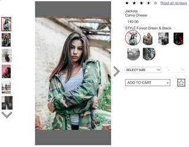
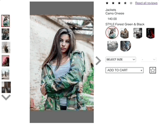
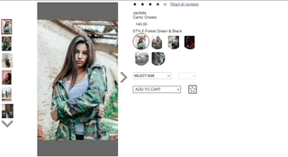

# Atelier

Atelier is a modern product detail page for the Atelier Project. 

The app in its entirety comes with an Overview, Related Items, and Reviews sections, this repository being for the Overview section. 

### Description 
>The Overview section allows you to navigate between different styles of a particular product and offers intuitive navigation along with default, expanded, and pannable zoomed in view options.

## Features

### Change Image Displayed
 

### Change Style Displayed

### Change View 

### How to Use
  1. git clone https://github.com/rpp32-fec-parasol/upgraded-umbrella.git
  2. navigate to the root and enter the following line:
    
    npm i axios, react, node, express, babel, webpack
  3. In your current CLI, enter the following line:

    npm run server
  4. Open another CLI and navigate to the upgraded-umbrella folder. Enter the following line: 

    npm run client

Your app should now be running on http://localhost:3000/

### Technologies
- React
- Babel
- Webpack
- Node
- Express

### Author Info
- LinkedIn:  https://www.linkedin.com/in/justin-tat-30a994238/

